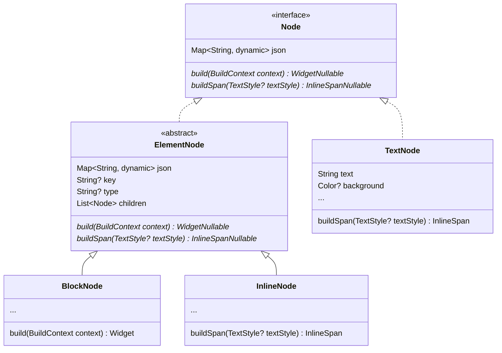

# theia_flutter

用flutter实现的富文本编辑器

## 介绍
`theia_flutter`的目标是所见即所得的富文本编辑器（**截至目前仅支持显示不支持编辑**）。`theia_flutter`的总体设计是协议层基于slate；渲染层将节点一一对应到flutter widget，因此整个theia_flutter会包含很多个TextField；因为有很多TextField，交互层例如选区、光标等通过操作手势指定哪一个TextField进行操作，最后再拼装起来。

## 协议层
`theia_flutter`协议层基于slate，创建`Thiea` Widget时需要传入slate结构的document，例如：[test.json](https://github.com/Fearimdly/theia_flutter/blob/main/assets/test.json)

`theia_flutter`中定义的结构如下:

每一个document中的节点会被转化成`Node`。

`TextNode`直接实现`Node`，没有`type``children`等属性，`Widget? build(BuildContenxt)`默认返回null

`ElementNode`同样实现`Node`，拥有`type``children`等属性

`BlockNode`和`InlineNode`继承`ElementNode`，例如paragraph是`BlockNode`，inline-code是`InlineCode`

这里遵循slate的规则：

> A "block" element can only be siblings with other "block" elements. An "inline" node can be siblings with Text nodes or other "inline" elements.

满足slate的规则通常可以使渲染层有更好的可预测性

## 渲染层
渲染时`Node`可以被build为Widget或者InlineSpan，根据上述slate规则，`BlockNode`需要实现`Widget build(BuildContext context)`，`InlineNode`和`TextNode`需要实现`InlineSpan buildSpan({TextStyle? textStyle})`。因此，`InlineNode`和`TextNode`的上层通常为`TextField`或者`Text.rich`

## 交互层
因为整个`theia_flutter`存在多个text相关widget，所以选区必须在所有text相关widget的上层处理。目前的设想是通过手势处理，当手势在哪一个widget上方就让哪一个widget处理，最后再讲结果拼接起来。在`flutter 3.3.0`版本，官方加入了`SelectionArea`，通过阅读源码了解到官方也是通过这样的思路实现的跨Widget选区，然而遗憾的是，TextField并没有支持`SelectionArea`（需要传入`SelectionRegistrar`）因此目前的处理方案是：在`theia_flutter` `readonly=true` 的时候，text由`Text.rich`实现，这样可以实现在只读时拥有选区功能，编辑功能稍后再做支持。

